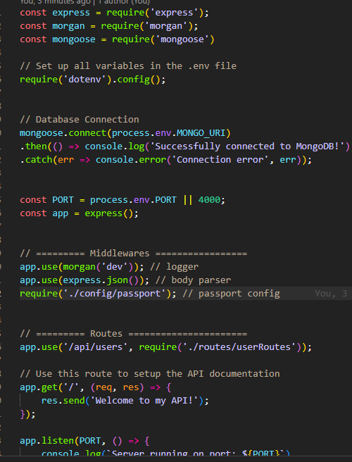

#  Per Scholas Software Engineer Bootcamp SBA 14
## Do you want to get ***free*** tech training from Per Scholas? 

## [Click Here to find out how!](https://perscholas.referralrock.com/l/7MIDHLPB/) 

*************************************************************************************************************

# SBA 14
## Secure Web Portal

# Scenario

“Innovate Inc.” is ready for the final phase of its new user portal. They need a complete, secure backend service that combines all the features you’ve been working on. This service will be the single point of entry for all users, managing their identities and their private data.

Your task is to build a secure Express application that allows users to register, log in (using both their email/password and a third-party provider like GitHub), and manage a private collection of personal “bookmarks” (or notes, tasks, etc.). This project will be the culmination of all the skills you’ve acquired in this module, from hashing passwords to implementing complex OAuth 2.0 flows.

A key principle for this project is Don’t Repeat Yourself (DRY). You are encouraged to reuse and adapt the code you’ve already written in previous labs and lessons. This is a common practice in software development and a critical skill to demonstrate.

# Instructions

# Task 1: Project Setup

Initialize Project: Set up a new project with npm and install express, mongoose, bcrypt, jsonwebtoken, dotenv, passport, and passport-github2.

Environment: Create a .env file to store your MONGO_URI, PORT, JWT_SECRET, GITHUB_CLIENT_ID, GITHUB_CLIENT_SECRET, and GITHUB_CALLBACK_URL.

Security: Create a .gitignore file.

Project Structure: Organize your code into a modular structure (e.g., config, models, routes, utils).

# Task 2: Models and Configuration

User Model: Create a User model. It should accommodate both local and third-party authentication. This means a user might have a password or a githubId, but not necessarily both. The email field should be unique and will serve as the primary link between a user’s local and GitHub-based identity.

Bookmark Model: Create a simple model for the user’s private resources (e.g., Bookmark). It must include a field to store the _id of the user who owns it (e.g., user: { type: Schema.Types.ObjectId, ref: 'User' }).
Passport Configuration: Set up a passport.js configuration file. This is where you will define your passport-github2 strategy, including the verify callback logic from Lesson 4. Remember, the callback should handle both finding existing users and creating new ones.

# Task 3: Local Authentication API

Reuse and Refine: Adapt the local authentication routes you built in Lab 1.
Create a POST /api/users/register endpoint.
Create a POST /api/users/login endpoint that, on success, returns a signed JWT.
You can reuse much of your utils/auth.js logic for signing tokens and for middleware.
Task 4: Third-Party Authentication API
Implement OAuth Routes: Add the GitHub OAuth routes from Lesson 4 to your user routes file.
GET /api/users/auth/github: This route will kick off the OAuth flow by redirecting the user to GitHub.
GET /api/users/auth/github/callback: This is your callback URL. It should use passport.authenticate, and upon successful authentication, it should sign a JWT for the user and return it to the client (e.g., via a redirect with a query parameter).

# Task 5: Secure Resource API

Build CRUD Endpoints: Create a new router file for your Bookmark resources (/api/bookmarks). Implement full CRUD functionality (POST, GET All, GET One, PUT, DELETE).
Apply Security Middleware: This is the most critical part of the assessment.
All bookmark endpoints must be protected by authentication middleware (authMiddleware from Lesson 3). Only logged-in users should be able to interact with them.
The endpoints must also be protected by authorization logic. Users should only be able to view, update, or delete their own bookmarks. This will require you to adapt the ownership-checking logic from Lab 2.

# Submission Instructions

Ensure your application is fully functional and all API endpoints have been tested with an API client like Insomnia or Postman.
Test all authentication flows: registration, local login, GitHub login.
Test all authorization rules: ensure one user cannot access another user’s bookmarks.
Submit a link to your completed GitHub repository.
